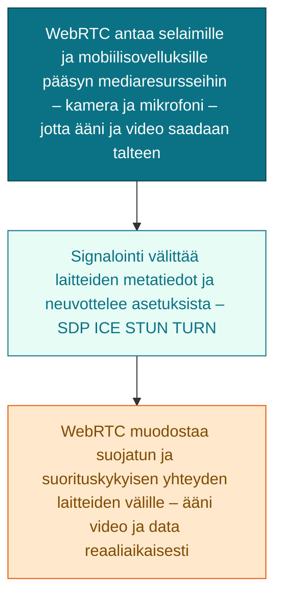
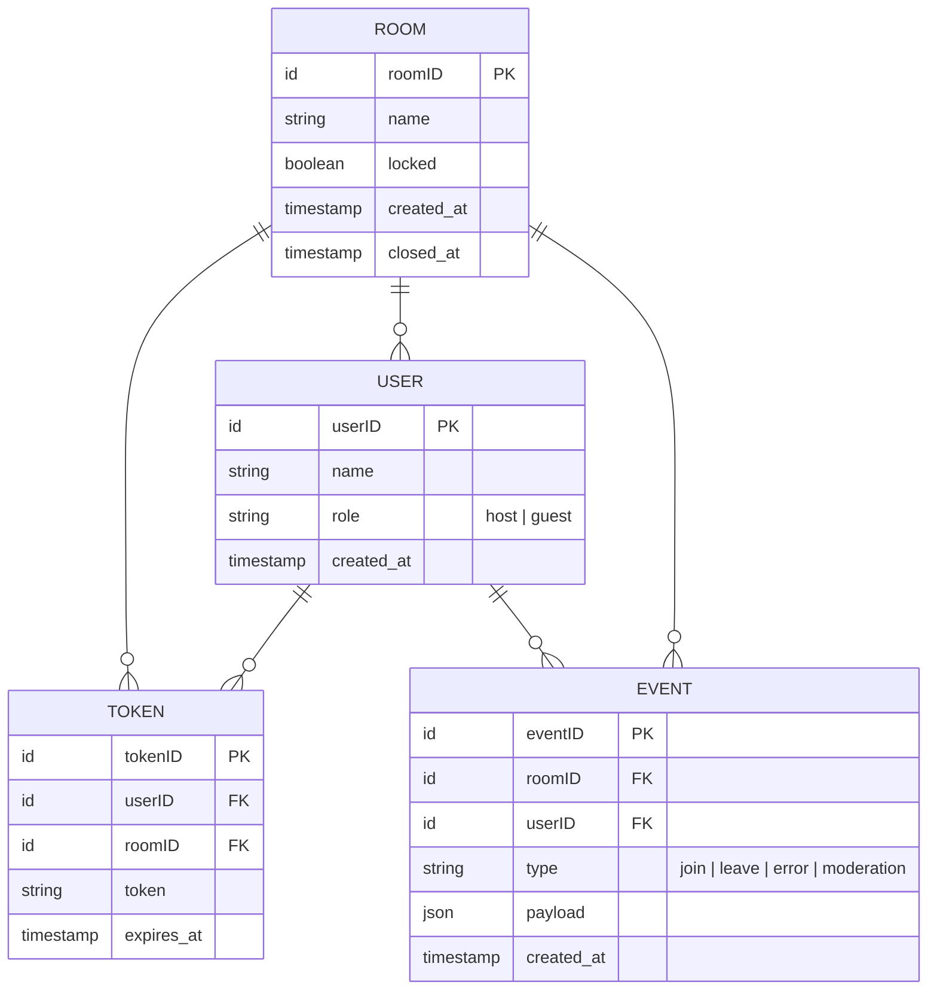
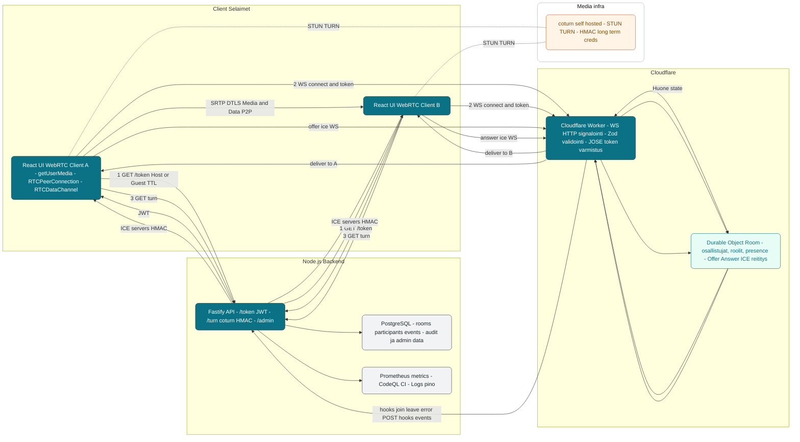
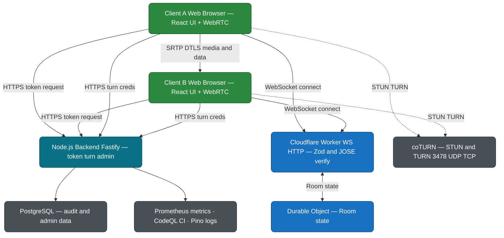
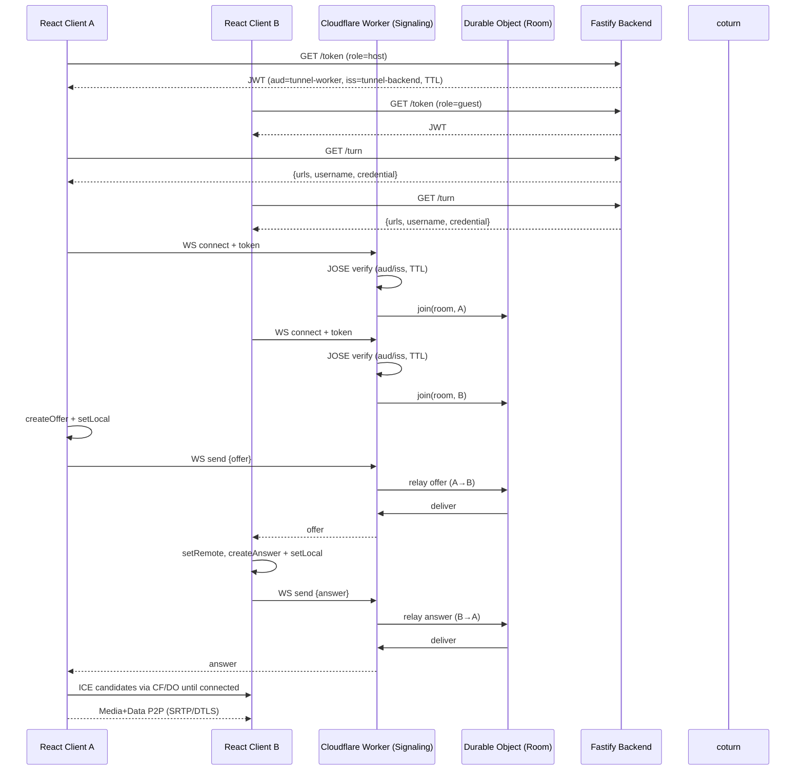

# Tunnel
Tunnel on opinnäytetyö projekti, jonka teen Haaga-helian ammattikorkea koulussa toimeksiantaja yritykselle Tunnelworks inc.

## Projektin ydin
Olen luomassa WebRTC protokollaan pohjautuvaa tietokoneiden välistä video, audio viestintä ja datansiirto sovellusta, jossa käytäjät voivat kommunikoida ja jakaa tiedostoja toistensa kanssa mahdollisimman hyvällä laadulla ja nopeudella.



WebRTC myöntää web selaimille ja mobiili soveluksille pääsyn käyttäjän media laitteisiin, kuten kameraan ja mikrofoniin napatakseen ääni ja video virtoja.

Signalointi on käyttäjien välisten laitteiden metadatojen viestittelyä keskenään neuvotellakseen tapahtuman asetuksista ja verkon erityispiirteistä, kaikki tämä ajaa yhtä asiaa, laitteiden välistä yhteyttä.

WebRTC muodostaa laitteiden välisen yhteyden hyödyntäen suojaisaa ja suorituskykyistä protokollaa välittääkseen ääni, video ja data virtoja laitteiden välillä.

WebRTC tukee useita ääni ja video koodekkeja, jotka mahdollistavat tehokkaan median pakkaamisen ja siirron. Yhteydet ovat suojattuja salauksella, mikä varmistaa viestinnän yksityiseen ja tietoturvan.
Se toimii myös eri verkkojen yli käsitellen NAT(Network Address Translation)-osoitteen muutokset ja palomuurit ICE(Interactive Connectivity Establishment)-protokollan avulla, joka etsii ja muodostaa suorat yhteydet osapuolten välille. Lisäksi WebRTC tarjoaa Data Channel-ominaisuuden, jonka avulla voidaan siirtää muuta kuin mediaan liittyvää dataa reaaliaikaisesti suoraan yhteyden osapuolten välillä.
(lähde: https://medium.com/@fengliu_367/getting-started-with-webrtc-a-practical-guide-with-example-code-b0f60efdd0a7)

Se mitä on odotettavissa projektiin liittyen on sen monimutkaisuus, monien liikkuvien osien osalta, joiden tulee toimia kunnolla yhdessä, tähän on käytettävissä validointi työkaluja, joita esittelen myöhemmin. Networkingiin, portteihin ja peer to peer kommunikaatioiden debuggausta, mutta siihenkin kun löytää sopivat logitus työkalut, niin helpottaa ohjelmistokehitystä. Selaimien eri tasoiset WebRTC tuet luultavasti tulee myös tuottamaan ongelmia, tähän on olemassa adapter.js joka normalisoi selaimen(Dokumentaatio: https://github.com/webrtcHacks/adapter).
Sovelluksen monimutkaisuuden vuoksi on hyvä aloittaa pienestä ja testata säännöllisin ajoin, jotta virhetilanteihin pääsee paremmin käsiksi, lisäksi on hyvin mahdollista että projektiin kuluu paljon aikaa, jonka vuoksi olemme sopineet että käyttöliittymä jää opinnäytetyön osalta minimalistiseksi ja autentikaatio lisätään opinnäytetyön ulkopuolella.
Suurin ongelma saattaa kuitenkin olla projektin moni osainen arkkitehtuuri ja sen palasten toimiminen yhdessä ilman rikkoutumista. Tämän vuoksi suuressa roolissa on oikeiden kirjastojen ja teknologioiden valinta, sekä oikeanlainen projektin palasten rakenne, esim monorepo voi olla hyödyllinen, sekä nniihin yhteinen sopimus skeema Zodin avulla. Uskon että suunnittelu vaiheessa valitut teknologiat ja kirjastot muuttuvat projekin edetessä ja näiden muutoksiin pidätän oikeudet.

## Teknologiat
### Backend 
Node.js ajonaikainen ympäristö jossa Typescript ohjelmointi kieltä käytetään luomaan taustatoimintoja sovellukseen yleisen hallinnan lisäksi:

- Roolit
  Host/Guest, jotta tiedetään kenen luoma huone ja ketä sinne kutsutaan.

- Kertakäyttöiset Tokenit
  Satunnaisesti luodut lipukkeet, tapaamishuoneeseen kutsumista varten. Tähän tyyliin:
  
  ```js
  require('crypto').randomBytes(64).toString('hex')
  ```
- TURN- tunnusten generointi
Generoidaan Long-term Credentialsit (HMAC), jotka on tarkoitettu antamaan aikarajoitetut käyttäjä : salasana parit ilman että jaetaan pysyvää salasanaa selaimelle. TURN palvelin Hostataan itse
Tähän tapaan:

```js
// Source - https://stackoverflow.com/questions/35766382/coturn-how-to-use-turn-rest-api
// Posted by mido
// Retrieved 11/5/2025, License - CC-BY-SA 4.0

var crypto = require('crypto');

function getTURNCredentials(name, secret){    

    var unixTimeStamp = parseInt(Date.now()/1000) + 24*3600,   // this credential would be valid for the next 24 hours
        username = [unixTimeStamp, name].join(':'),
        password,
        hmac = crypto.createHmac('sha1', secret);
    hmac.setEncoding('base64');
    hmac.write(username);
    hmac.end();
    password = hmac.read();
    return {
        username: username,
        password: password
    };
}

```
- CodeQL analyysit
  Tehdään CI putki monorepoon, jossa tarkistetaan riippuvuudet ja tehdään WebSocket tarkistukset Origin-check, CORS, strict JSON parsing, lisäämään turvallisuutta ja laatua
  
- Postgre yhteys
  - Tehdään toiminnot Adminille, oikeudet kick, lock- ja unlock room.
  - Logitetaan virheilmoitukset, liittyi/poistui, jos tarvitsee SDP/ICE seurantaa

- Prometheus?
  Halutaanko käyttää Prom-clientiä erilaisiin mittauksiin.


#### Teknologia valinnat ja kirjastot


Turvallisempi kehittämis versio JavaScriptistä tyypityksen vuoksi. TypeScriptillä tuotettu toimiva koodi toimii varmuudella, kun taas JavaScriptissä saattaa toimivuus olla kiinni Stringien ja Numbereiden mismatchistä.
(Dokumentaatio: https://www.typescriptlang.org/docs/)


Valitsin Fastifyn Expressin sijaan koska, Fastify on väitetysti tämän hetken nopein viitekehys toteutettuna Node.js:lle. se käsittelee enemmän pyyntöjä per sekuntti, käsittele enemmän dataa per sekuntti ja käsittelee suuremman kokonaismäärän pyyntöjä. Siinä on parempi Typescript kokemus. Fastifylla on valmiimpia plugineja. 
(Dokumentaatio: https://fastify.dev/docs/latest/Guides/Getting-Started/)


Käytetään pyyntöjen ja viestien ajonaikaiseen validointii, jotta body, query ja path toimii kuten pitää. Ajatuksena että skeema ja tyypit syntyvät samasta lähteestä, jotta Client, Worker että Node eivät ole keskenään eri mieltä viestimuodosta, kirjoittamalla yhden szod-skeeman josta johdan TypeScript tyypit. Tietoturvallisista syistä Zod tarjoaa mahdollisuuden lisätä argumenteiksi Session Description Protocol: (SDP) min ja max arvot, joilla pystytään esimerkiksi estämään isolla SDPllä tehty hyökkäys. 
(Dokumentaatio: https://zod.dev/)

**Drizzle**

Object-relational mapping, joka käsittelee tietokannasta (postgre/SQLite(Jos tähän päädytään, mietitään kannattaako ORM käyttää.))tulevat pyynnöt. Tämän avulla luodaan abstraktiokerros ohjelman ja tietokannan väliin, jotta ei tarvitse kirjoittaa suoria SQL kyselyjä. Toiminta perustuu relaatiotietokantojen tietojen muuttamisen olio-ohjelmoinnin objekteiksi. Haittapuolena yleensä ORM kohdalla koetaan suorituskyvyn mahdollinen heikkeneminen.
(Dokumentaatio: https://orm.drizzle.team/docs/overview)

**Helmet**

Käytetään turvaamaan sovellus tunnetuilta web haavoittuvuuksilta, asettamalla HTTP Headerit asianmukaisesti. Sopii hyvin käytettäväksi Fastifyn kanssa. 
(Dokumentaatio: https://helmetjs.github.io/)

**Pino**

Helposti luettava, nopea strukturoitu logitus JSON muodossa. .Sopii hyvin käytettäväksi Fastifyn kanssa.
(Dokumentaatio: https://github.com/pinojs/pino-http#readme)

**Crypto module**

Cypto tekee TURN tunnusten salauksen eli Hash message authentication code (HMAC) -laskennan muodostaen Number used once (nonce) tai Universally unique identifier (UUID) yksilölliset tunnisteet. 

**Jose**

Käytetään JSON Web Tokenien (JWT) allekirjoittamiseen. Asetetaan tässä kohtaa Time To live (TTL), tokenien turvaamiseen. Täytyy listätä TTL loppumisen varalta mahdollisuus päivittää token.
(Dokumentaatio: https://github.com/panva/jose)

#### Mahdollisia ongelma kohtia ovat: 
- Tyypityksen ja Zod Skeemojen yhdistäminen voi tuottaa virheitä, kuten tyypit ei täsmää dataan, kokeillaan yhteistä skeemakirjastoa ja yksinkertaisia tyyppejä, kasvatetaan monimutkaisuutta vähitellen
- On paljon liikkuvia osia ja miten ne asiat toimivat yhdessä, kuten porttien, ICE ja TURN konfiguraatiot, Signaloinnin ja tokenien toiminta.


### Frontend 

Luodaan selainpohjainen käyttöliittymä huoneisiin liittymiseen, aulan moderointiin ja itse puheluun, joka tukee ääni ja video toimintoja, mahdollisesti myös datan siirtoa. Signalointi liikkuu WebSockettia käyttäen Cloudflare Workeriin, media suoraan WebRTC:llä. Toistaiseksi on yksinkertainen sovellus jossa toinen generoi kutsun ja lähettää sen vieraalle, joka hyväksyy/käyttää tokenin, myöhemmin voi lisätä kaverilistan tai autentikoinnin mukana käyttäjät, joita pystyy kutsumaan sovelluksen sisällä.
- Kokous huoneiden ja aulan hallinta
  komponentit oleellisien toiminnallisuuksien näyttämiseksi: video, chat, Waiting list, approve/deny, add, send invitation    ja tiedostojen jakaminen?
  Vieras:
  - Käyttäjä syöttää kutsulinkin, joka on kerta käyttöinen token, joka haetaan Nodesta, jossa se luodaan ja Jose                allekirjoittaa.
  - Kevyt chat toiminto
  - Notifikaatiot React Toastilla, kun yhteys onnistuu tai epäonnistuu.
  - poistuminen tapaamisesta
  Isäntä:
  - Luo kutsu linkin, jonka pystyy lähettämään suoraan sähköpostilla tai kopioimaan. 15 min ttl?
  - Pystyy potkimaan tai lisäämään (multi peer) vieraita.
  - poistuminen tapaamisesta

- signaalien ohjaus
  Itse signalointi toteutetaan Cloudflare Workerilla, joka ajaa asian välitäjänä käyttäjien välillä ilman että media kulkee sen läpi. Kun käyttäjä haluaa yhdistää itsensä huoneeseen, frontend tekee Nodelle pyynnön POST / token, jossa se saa allekirjoitetun JWT tokenin, roomID tunnuksen ja roolin. Sen jälkeen frontend yhdistää Cloudflare Workeriin avatakseen WebSocket yhteyden, jossa on tiedot tapahtuman tyypistä tässä tapauksessa join. 

#### Käytetyt teknologiat ja kirjastot


TypeScript natiivi viitekehys, joka on moderni, kevyt ja nopea


Käytetään tyylitykseen (dokumentaatio: https://tailwindcss.com/docs/installation/using-vite)


Käytetään vietin yhdenmukaistamiseen ja validointiin.

**RTCPeerConnection**

WebRTC yhteyden hallinta, joka mahdollistaa kaksisuuntaisen viestinnän.
(dokumentatio: https://webrtc.org/getting-started/peer-connections)

**WebSocket**

Signalointi yhteys Cloudflare Workeriin.
(dokumentaatio: https://websocket.org/reference/websocket-api/)

#### Mahdollisia ongelma kohtia ovat: 

Yhteyksien ylläpitämisen, saadaanko toimimaan kuten pitää. Selainten rajoitukset tulee ottaa huomioon.


### Cloudflare Worker

(Dokumentaatio: https://workers.cloudflare.com/)

Nämä ovat serverless palveluita, jotka on ajossa globaalissa edge verkossa, lähellä loppukäyttäjää rakentaakseen ja julkaistakseen sovelluksia. Koodi suoritetaan maailmanlaajuisesti Cloudflaren verkon reunapalvelimilla (edge), tarkoittaen että koodi ajetaan maantieteellisesti lähimpänä käyttäjää, mikä vähentää viivettä ja nopeuttaa sovelluksen toimintaa. Workers toimii kuten selaimen service worker, eli se pystyy sieppaamaan ja käsittelemään HTTP pyyntöjä, muokkaamaan niitä, ohjaamaan liikennettä uudelleen tai palauttamaan sisältöä suoraan verkon reunalta. Serveless tarkoittaa ettei kehittäjän tarvitse hallita palvelimia tai skaalausta, koska Clouflare hoitaa sen automaattisesti
Toimii projektin signalointi palvelimena, joka välittää vieestit käyttäjien välillä WebSocketin kautta.
Drizzle täysin tukee tässä osassa käytettyä Durable Objectsia ja Cloudflare Workersiä (dokumentaatio: https://orm.drizzle.team/docs/connect-cloudflare-do)

#### Teknologia valinnat ja kirjastot

**Durable Objects**

Hallitsee WebSocket yhteyksiä ja mahdollistaa pysyvän ja synkranoidun tilan yksittäiselle huoneelle. Jokainen Durabble Object instanssi vastaa yhdestä huoneesta.
https://developers.cloudflare.com/durable-objects/get-started/

**WebSockets**

Kaksisuuntainen signalointikanava selaimen ja Cloudflare Workerin välillä. Ylläpitää yhteyden käyttäjien välillä, siirtää SDPT ja ICE kandidaatit

**Hono**

Cloudflare Workerin HTTP-reitityskehys. Kevyt ja nopea kirjasto, joka selkeyttää reittien
(dokumentaatio: https://hono.dev/docs/)

**Zod**

Tarkistaa jokaisen signalointi viestin rakenteen ennen kuin se lähetetään eteenpäin eli suojaa Worker rajapinnan väärä muotoiselta datalta.

**Jose**

Tässä kohtaa tätä käytetään varmentamaan allekirjoitettu JWT ennen WebSocket yhdistystä, tarkistamalla että huoneeseen liittyvä käyttäjä on oikeutettu ja että token on Noden allekirjoittama.

#### Mahdollisia ongelma kohtia ovat: 


### Tietokanta  / 

Riippuen logituksen määrän tarpeesta käytetään joko pienempää SQLiteä tai isompaa Postgrestä. Postgres sopii hyvin Drizzlen kanssa kun taas SQLitellä sitä ei tarvitse käyttää.
Itse sovelluksen tietokannan ei tarvitse olla iso, siihen kuuluu: käyttäjät, Huoneet, Tokenit, yhteys ja tapahtuma logit ja Admin toiminnot



### STUN/TURN

WebRTC-yhteyden muodostaminen ei ole aina suoraviivaista, koska suurin osa käyttäjistä toimii reitittimen, palomuurin tai mobiiliverkon takana. Näissä ympäristöissä laitteella ei ole julkista IP-osoitetta, joten yhteys toiseen selaimeen ei onnistu ilman välikättä. Tätä varten WebRTC käyttää kahta erillistä protokollaa: STUN (Session Traversal Utilities for NAT) ja TURN (Traversal Using Relays around NAT).

STUN toimii ensimmäisenä vaihtoehtona. Sen tehtävä on selvittää, mikä on käyttäjän julkinen IP-osoite ja portti, kun liikenne lähtee verkosta ulospäin. Selain lähettää STUN-kyselyn palvelimelle, joka palauttaa tiedon takaisin, näin selaimen ICE (Interactive Connectivity Establishment) protokolla saa selville kaikki mahdolliset yhteysreitit, joita voidaan kokeilla. Jos nämä suorat reitit eivät kuitenkaan toimi, esimerkiksi yritysverkon tai tiukan NAT asetuksen vuoksi, käytetään varasuunnitelmaa, eli TURN-palvelinta.

TURN toimii välityspalvelimena, se vastaanottaa ja edelleen lähettää median liikenteen kahden osapuolen välillä. Vaikka tämä lisää hieman viivettä, se takaa sen, että yhteys toimii lähes missä tahansa verkko-olosuhteissa. Koska TURN välittää salattua mediaa (DTLS + SRTP), sen kautta ei voi lukea sisältöä, mutta se kuluttaa palvelin resursseja, siksi sitä ei käytetä ensisijaisesti vaan vain silloin, kun suora yhteys ei onnistu.

Projektissa TURN-palvelin toteutetaan coturnilla, joka on avoimen lähdekoodin, vakaa ja laajalti käytetty TURN/STUN-toteutus. Palvelin hostataan virtuaalipalvelimella (Rahti, Render, AWS), jotta voidaan hallita sen asetuksia, salaisuuksia ja käyttörajoituksia.
Coturn asennetaan esimerkiksi Linux-palvelimelle ja konfiguroidaan käyttämään REST API -autentikaatiota (use-auth-secret), jolloin tunnistautuminen toimii HMAC-salausten avulla.

Noden puolella on oma reitti /api/turn, joka generoi käyttäjälle hetkellisen käyttöavaimen.
Tämä perustuu HMAC (Hash-based Message Authentication Code) -laskentaan, jossa yhdistetään palvelimen salainen avain ja nykyinen aikaleima. Näin muodostetaan niin sanottu long-term credential, joka on voimassa esimerkiksi 15 minuuttia ja kelpaa vain yhteen istuntoon. Ratkaisu estää pysyvien salasanojen vuotamisen ja tekee hyökkäyksistä merkityksettömiä, koska jokainen tunnus vanhenee nopeasti.


## Sovelluksen arkkitehtuuri

### Koko järjestelmän komponentit ja niiden suhteet

### Kokonaiskuva tiedon kulusta ja rajapinnoista


## Sekvenssikaavio

SDP = Session Description Protocol
ICE Candidate = Interactive Connectivity Establishmentin useat vaihtoehtoiset reitit.
(STUN) = Session Traversal Utilities for NAT selvittää selaimen julkisen IP-osoitteen ja portin.
(TURN) = Traversal Using Relays around NAT on varasuunnitelma. toimii välitys palvelimena jos suoraa yhteyttä ei löydy

## Projektin etenemis vaiheet

Projekti alkuvaiheessa on tavoitteena rakentaa mahdollisimman selkeä ja laajennettavissa oleva perusta, johon koko sevellus pohjautuu. Olen päätynyt tekemään monorepon, jossa on kolme pääsovellusta frontend, backend ja Cloudflare Worker, jonka lisäksi on Zodille hakemisto contracts, sovelluksen yhtenäisille skeemoille ja TS tyypeille. Täten varmistetaan että koko järjestelmä puhuu samaa kieltä: käyttää samaa viestimuotoa, samoja tyyppejä ja samoja validointi sääntöjä. Näin ehkäistään virheitä, joita syntyy helposti kun rajapintoja kehitetään irrallaan toisistaan.

Ensimäiseksi luodaan Node.js taustapalveli, joka toimii sovelluksessa kuin ihmiskehos selkäranka. Se käynnistyy Fastifyn avulla ja tarjoaa kaksi tärkeää rajapintaa:
/token, joka luo ja allekirjoittaa kertakäyttöisen JWT tunnisteen, JOSE kirjastoa hyödyntäen, huoneeseen liittymistä varten.
/turn, joka palauttaa dynaamiset ICE palvelimet (STUN/TURN) turvallisesti lasketuilla HMAC salauksella.

Backendissä otetaan käytöön Helmet suojaamaan yleisiltä haavoittuvuuksilta ja Pino informatiivistä ja strukturoitua logitusta varten. Varmistetaan että rajapinnat toimii testaamalla Postmanin avulla. Toiminnan varmistumisen jälkeen luodaan Serveless ratkaisuna Cloudflare Worker, joka toimii kevyenä ja nopeana reunapalveluna. Tämä asennetaan wrangler työkalulla ja se sisältää kaksi osiota:
/index.ts, joka käsittelee HTTP ja WebSocket pyynnöt Hono kehyksellä.
/room.ts, joka määrittää Durable Objectin, joka vastaa yhdestä huoneesta ja säilyttää sen tilan muistin.

Kun Node ja Worker ovat toiminnassa, niiden välille rakennetaan yhteys JWT tunnisteiden avulla. Node luo ja allekirjoittaa tokenin ja worker varmentaa sen julkisella avaimella ennen yhteyden hyväksymistä. Näin projektille syntyy turvallinen silta Backendin ja Cloudflare workerin välille.

Tämän jälkeen keskitytään signalointiin, joko on koko WebRTC projektin toiminnan sydän. Cloudflare Workerille toteutetaan WebSocket reitti, johon selain yhdistää avatessaan yhteyden. Jokaisen yhteyspyynnon mukana lähetetään Noden allekirjoittama JSON Web Token (JWT), jonka aitous varmistetaan Workerissa JOSE-kirjaston avulla. Kun token on todettu luotettavaksi, yhteys ohjataan huonekohtaiselle Durable Objectille, joka toimii pysyvänä ja synkranoituna tilahallintana. Jokainen huone saa oman instanssinsa, joka pitää kirjaa huoneen tilasta ja osallistujista. Durable Object toimii vähän niinkuin signaloinnin muistina ja välittää viestityypit (Offer, Answer ja ICE-kandidaatit) oikeille vastaanottajille. Eli käyttäjä lähettää Offerin, Durable Object välittää sen vastaanottajalle, joka vastaa Answerilla ja lopulta molemmat vaihtavat ICE-kandidaatteja kunnes suora yhteys on luotu, jonka jälkeen sovelluksen signalointiketju on valmis ja selaimet osaavat neuvotella yhteyden tekniset parametrit keskenään. Kaikki nämä viestit validoidaan Zodilla sisääntulossa, jotta vääränmuotoiset tai liian suuret paketit eivät pääse sekoittumaan logiikkaan. Tämä myös suojaa sovellusta, koska signalointipalvelu on ensimäinen piste, johon ulkoinen liikenne osuu.

Kun olen saanut signaloinnin toimimaan, seuraavana vaiheena on huolehtia verkkojen välisestä yhteyden muodostuksesta. WebRTC tarvitsee STUN- ja TURN palvelimet, jotta yhteys toimii myös palomuurien ja NAT:ien takaa. Projektissa käytetään omaa coturn palvelinta, joka hostataan itse. Node tarjoaa Fastifyn kautta /turn endpointin, joka palauttaa selaimelle dynaamiset tunnukset.
Nämä kyseiset tunnukset luodaan turvallisesti long term credentials (Hash based message authentication code(HMAC)) menetelmällä, joilla vältetään pysyvien salasanojen jakaminen käyttäjille. Ennen jokaista yhteyden avausta selain pyytää nämä tiedot ja saa käyttöönsä listan ICE-palvelimista (urls, username, credential). Näin varmistetaan, että yhteys muodostuu myös tiukoissa verkoissa ja että fallback TURNin kautta toimii, jos suora PeerToPeer yhteys ei ole mahdollinen.

Kun edellä mainitut vaiheet ovat valmiina ja testattuina, on aika siirtyä käyttöliittymän pariin. Reactilla ja Vite kehyksellä rakennetaan selkeä ja minimalistinen käyttöliittymä, jossa käyttäjä voi joko luoda huoneen tai liittyä siihen kertakäyttöisellä kutsulinkillä. 
RTCPeerConnection rajapinnassa olevalla getUserMedia metodilla pyydetään selaimelta luvat kameran ja mikrofonin käyttöön ja itse rajapinta hoitaa yhteyden muodostamisen toiseen käyttäjään. Käyttöliittymässä on kaksi näkymää: liittymis sivu ja itse konferenssi näkymä, jossa näkyvät sekä oma että etävideo kuva, mikrofonin ja kameran kytkimet sekä poistumis painike. Kaikki signalointi kulkee WebSocketin yli Cloudflare Workeriin ja sovellus reagoi yhteyden tila muutoksiin selkeillä ilmoituksilla, johon käytetään React Toastia.
Tässä vaiheessa sovellus toimii jo Peer to Peer videopuhelun tasolla, sillä toinen käyttäjä luo huoneen ja toinen liittyy siiheen turvallisen linkin avulla ja videokuva sekä ääni siirtyvät tämän yhteydessä luotuun huoneeseen.

Seuraavaksi tavoitellaan pysyvyyttä ja sovelluksen hallintaa. PostgreSQL tietokanta otetaan käyttöön ja sen päälle rakennetaan skeema Drizzle ORM:llä.
Tietokantaan tallennetaan perustiedot käyttäjistä, huoneista, tokeneista ja tapahtumista. Backend tarjoaa hallinta rajapinnan, jolla voidaan tarkastella aktiivisia huoneita, poistaa tai lukita niitä sekä tarkastella liittymis- ja poistumis tapahtumia. 
Worker lähettää tärkeimmät tapahtumat join, leave, error, backendiin HTTP hookeina, jotka kirjataan tietokantaan. SDP ja ICE dataa ei tallenneta suoraan, vaan ne pyritään hajauttaa (hash) ja pienentää, jolloin tietoturva paranee ja mahdollistetaan myöhempi auditointi ilman arkaluontoista tietoa, sillä SDP sisältää paljon teknistä tietoa yhteyden osapuolesta, kuten käytetyt verkko osoitteet ja mitä mediaa käytetään, kun taas ICE sisältää portit ja IP-osoitteet. Näisä on hyvä saada talteen osa, niin että yhteys tapahtuma on todennettavissa mutta ei kuitenkaan niin paljoa että ulkopuolisesti saisi siitä mitään tärkeää tietoa ulos. Drizzlen avulla skeeman hallinta pysyy koodissa versio hallittuna ja migraatiot ovat toistettavia kaikissa ympäristöissä.

Tämän jälkeen projektia laajennetaan aula ja chat toiminnoilla. Aula logiikalla mahdollistetaan huoneen luojan mahdollisuus hyväksyä tai hylätä vieraita ennen kuin he liittyvät. Tämä toteutetaan Durable Objectin sisällä, niin että jokainen vieras lähettää liittymispyynnön, joka odottaa isännän hyväksyntää.
RTCPeerConnectionin CreateDataChannel metodi mahdollistaa chat toiminnon. Siirrossa data jaetaan paloihin ja lähetystä säädellään kuuntelemalla bufferedAmountLow tapahtumia, jotta kanava ei tukkeudu. Tämä mahdollistaa kevyen ja reaaliaikaisen chatin ilman ulkoista palvelinta. Halutessaan tähän voi lisätä pienen tiedoston siirron. (dokumentaatio: https://developer.mozilla.org/en-US/docs/Web/API/RTCPeerConnection/createDataChannel)

Kun toiminnallisuudet on kasassa, siirretään painopiste laatuun ja tietoturvaan. Zod skeemat muutetaan strict tilaan ja viestityypeille asetetaan koko rajoitukset, erityisesti SDP:n osalta, jotta väärinkäytöksiä ei synny(lisätietoa hyökkäyksestä: https://www.rfc-editor.org/rfc/rfc8844.html). 
JOSE tokeneihin lisätään audience ja issuer kentät, jotta estetään tokenien kierrätys väärissä ympäristöissä ja vahvistetaan että Node ja Worker juttelevat vain keskenään. Lisätään myös lyhyt Time To Live ja se että käyttöliittymä osaa automaattisesti pyytää uuden tokenin, jos voimassaolo aika päättyy. Koodiin oteaan mukaan jatkuva analyysi CodeQL:n avulla, joka tarkistaa mahdolliset haavoittuvuudet, sekä npm audit riippuvuksien seuraamiseksi.
Playwrightilla toteutetaan yksinkertainen end-to-end-testi, joka avaa kaksi selainta, liittyy samaan huoneeseen ja varmistaa, että video virtaa puolelta toiselle ilman virheitä.
Lisäksi Fastifyn kautta voidaan tarvittaessa julkaista Prometheus-metriikat, jotka kertovat esimerkiksi aktiivisten huoneiden määrän, keskimääräisen yhteyden keston ja virheiden määrän.

Projektin viimeisessä vaiheessa painopiste on viimeistelyssä ja skaalauksessa.
Durable Objecteihin lisätään elinkaaren hallinta: jos huone on ollut passiivinen tietyn ajan, se suljetaan automaattisesti.
README ja dokumentaatio viimeistellään niin, että sovelluksen saa pystytettyä ja testattua yhdellä komennolla.
Tässä vaiheessa kokonaisuus on toimiva WebRTC sovellus ja osoitus siitä, miten Node, Fastify, Drizzle ja Cloudflare Workers muodostavat yhdessä modernin, skaalautuvan ja tietoturvallisen viestintä alustan.

## Tietoperusta
Tietoperustana käytetään jo annettuja dokumentaatio linkkejä, aiheeseen liittyviä kirjoituksia, tutoriaali videoita sekä hyödynnetään opinnäytetyön toimeksianto yrityksen yhteyshenkilön tarjoamaa apua sekä oppilaitoksesta mahdollisesti saatavaa tukea.


